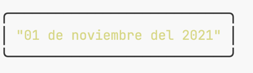
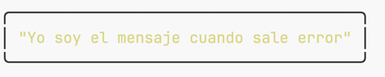
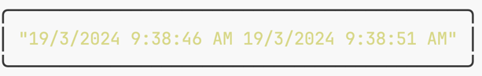
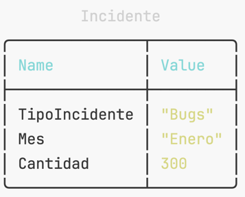
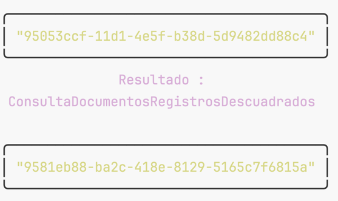

# Descripción del Examen

El exámen tendrá una puntuación máxima de 15 puntos está dividido en 4 secciones.  

Usted deberá crear una rama con el siguiente formato `[aliasCorreo]_examen`, el cual será el identificativo de su solución al exámen en el repositorio, Ej:
**zulest_examen**

Debe sustituir sus datos personales en la siguiente instrucción que se encuentra en `Program.cs`:  
`new DatoPersona("Tomas Zules", "SifizSoft")`

El método `Impresion()` ya se encuentra implementado, es el que se encargará de dibujar en la Consola el resultado de su
codificación.

De igual forma se proveen las extensiones `TReturn FbsPipe<T, TReturn>(this T @this, Func<T, TReturn> funcion)` y `void FbsPipeAction<T>(this T @this, Action<T> accion)` por si necesitan durante la ejecución del exámen.

Tendrá un tiempo de 1:30 horas para la ejecución de las actividades, una vez culminado debera realizar un `push` de su rama al repositorio. **Solo serán evaluados los códigos que se encuentren en el repositorio** y se hubiera realizado el `commit` y `push` hasta las 18:00 horas del día de hoy 19 / MARZO / 2024.

**EXITOS....**
## SECCIÓN - EXTENSIONES

### Ejercicio 1 (1 punto)

Descomente el cuerpo del método `EgEjercicio1_Puntaje1()` y corrija el error. El resultado debe ser el siguiente:

### Ejercicio 2 (1 punto)

Descomente el cuerpo del método `EgEjercicio2_Puntaje1()` y corrija el error. El resultado debe ser el siguiente:

### Ejercicio 3 (3 puntos)

Descomente el cuerpo del método `EgEjercicio3_Puntaje3()` y corrija el error.
En este ejercicio debe lograr que se esperen 5 segundos, y el resultado sea con el siguiente formato:

## SECCIÓN - LINQ

En esta sección se comprobarán los conocimientos relacionados con el manejo de colecciones usando Linq

### Ejercicio 1 (2 puntos)

Para este ejercicio se da la implementación de la
extensión:  `IEnumerable<IGrouping<TKey, IDictionary<TColumn, TValue>>> Pivot<TSource, TKey, TColumn, TValue>(
this IEnumerable<TSource> source, Func<TSource, TKey> rowSelector,
Func<TSource, TColumn> columnSelector, Func<IEnumerable<TSource>, TValue> valueSelector)` 
Debe interpretar la misma para dada la colección `salesData` en el método `LiEjercicio1_Puntaje2()` procese los datos
para obtener
por **Tipo de Incidente** la cantidad que ha ocurrido en cada **Mes**

## SECCIÓN - CONOCIMIENTOS DE C#

### Ejercicio 1 (1 punto)

Implemente un Operador que corrija el error al descomentar el contenido del método `CsEjemplo1_Puntaje1()`, la salida del método debe ser la siguiente:

### Ejercicio 2 (2 puntos)

Debe analizar la clase `DatosFinancierosWs` y revise si cumple con los principios **SOLID**, si cumple agregue un comentario encima de la clase diciendo **CUMPLE LOS PRINCIPIOS**, si no cumple entonces realice la refactorización que crea necesaria para cumplir los principios. 

## SECCIÓN - CONOCIMIENTOS DE PROCESOS DE FINANCIAL

### Ejercicio 1 (2 puntos)

Implemente el método `ConsultaDocumentosRegistrosDescuadrados()` dentro de la entidad `RegistroContable` para consultar los registros que se encuentren descuadrados tanto por **Documento** como por **Oficina** y seleccione el listado de documentos. El resultado debe ser el siguiente:

### Ejercicio 2 (3 puntos - si se implementa con Closure 5 puntos)

Refactorice el método `DRLPorSecuencialSecuencialEmpresaActivo()` utilizando un **Closure** para que el método `DevuelveCamino` solo realice una lectura a las tablas **Division** y **PadreDivision**, el método principal debe estar codificado con el patrón Builder